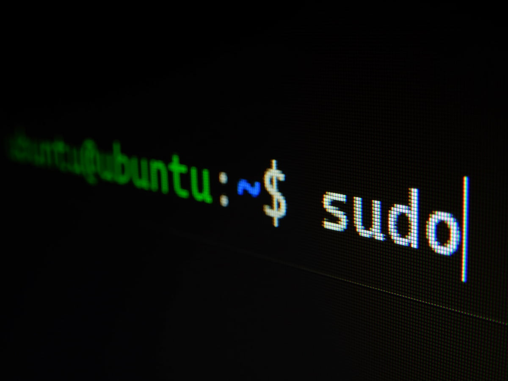

Long time ago, about 2008-2012 I was an excited to discover Linux for myself. In those time it was something amazing and I started to use it. Also I started to take active part in the Linux communities and had a blog about Ubuntu. As I can remember there was a lot of problems, but it was really interesting to solve them in the daily life and help other people to discover Linux.

## Why did I stop using Ubuntu in 2012?

There were at least few reasons as I can remember.

First, I suffered without Microsoft Office when I worked on my diploma. As I can remember, it was possible to run MS Office through the Wine, but it worked not very stable and I have everyday problems with opening documents. Open source package LibreOffice wasn't so good in those times (I don't know about nowadays, but will take a look on it).

The second reason was that very popular games couldn't run on Linux OS. Yeah, I like to play time to time and it was a real trouble. I loved WarCraft and wanted to play it sometimes.

Previous two was really so bad, but this one hurt me so much, that I decided to stop using Ubuntu after they replaced Gnome with the Unity. Unity was so useless and buggy. Really, I tried to use it few times, but I couldn't understand why they did it. Also I waited a bit, I thought that they will return Gnome because they had a lot of hate from the users, but they didn't.

And the last reason was that Windows 8 was released and it looked fine and worked not so bad.

## Why I decided to give it a try again?

It was long time with Windows till nowadays, but I had a vacation at the end of the August and had some free time. I tried to install on my empty hard disk the new Ubuntu and I was surprised. It worked pretty fast and looked very nice. I spent some time to install drivers for my wi-fi stick, but it wasn't so hard. Also I tried to install Steam and Dota2 and I was shocked. Dota2 working perfect on maximum video settings on my desktop on the old hard drive. And my old rx580 felt more comfortable than on Windows. Also I found that a lot of games in Steam supported Linux.

After that I bought the new ssd disk and moved to the Ubuntu 21.04 to give it a try. The new ssd is to have backup of everything from my Windows ssd.

The first run wasn't so easy, I had some problems and I felt the taste of Linux. But after spending few hours I moved myself and changed permanently my first boot device to Ubuntu ssd. Today is the end of the second week that I'm using it and I can say that I like it. Will try to test everything that I need in daily life and will share some experience if I'll found it interesting.