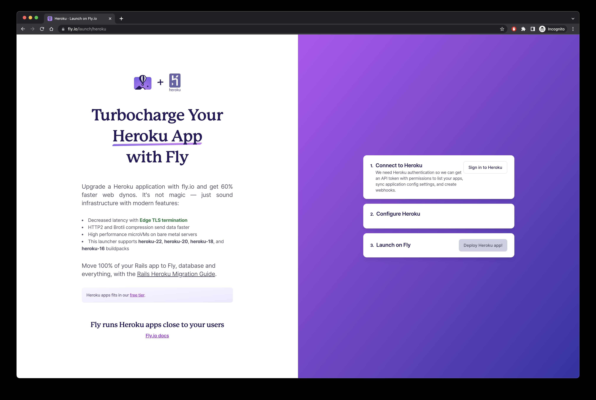
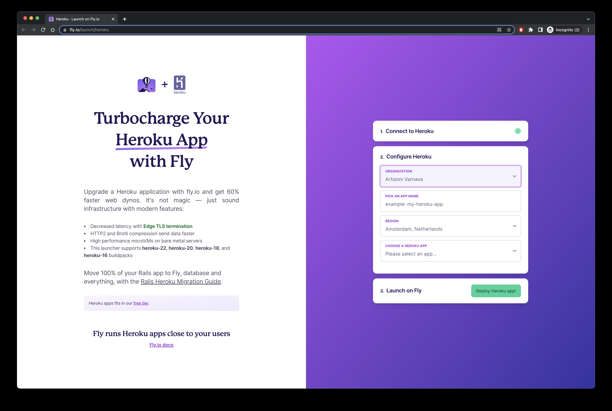

As everyone knows, Heroku removed their free tier plan and from 28 November 2022 there will be no free plan to use. Thousands of people who isn't familiar with the IT used it for small projects. One of the popular project is [Nightscout](https://github.com/nightscout/cgm-remote-monitor) client which used widely. Here is instruction how to migrate it fast and without coding at all.

## Fly.io

I found service that has one click migration from the heroku. It's not completely free, but free plan should be enough for the Nightscout app. So just use that link to the [One-Click Heroku migrator](https://fly.io/launch/heroku).

### Sign in to Heroku

Just login to your Heroku account and give access. It will let Fly.io to get all needed data for migration process.

### Sign in to Heroku

Just fill the inputs:

- Application name
- Region (try to choose the closest one for your location)
- And choose Heroku app for migration

Also, on that step it will ask you to add payment method. They need it to make sure that the service will be able to charge you if you will run out of free limits (but don't worry, it shouldn't ever happen).

**_NOTE:_** People from the Russia will have problems with adding their credit cards, but I hope it will work for the Belarusian credit cards.

### Launch

Process will start, and it will take few minutes to migrate the project. After that you will have working service, connected to the same DB that Heroku was.

### Change service address

You will be able to see you new application running. And you will see the new url like project-name.fly.dev. Change service address wherever you need. It could be xDrip, Android APS and so on.

### Stop your Heroku app

Just stop your Heroku app to avoid costs in the future or other problems.

## Conclusion

Process is pretty simple and takes about 10 minutes in general. I will update this post with more details later. Did it ASAP to help people migrate their services.
